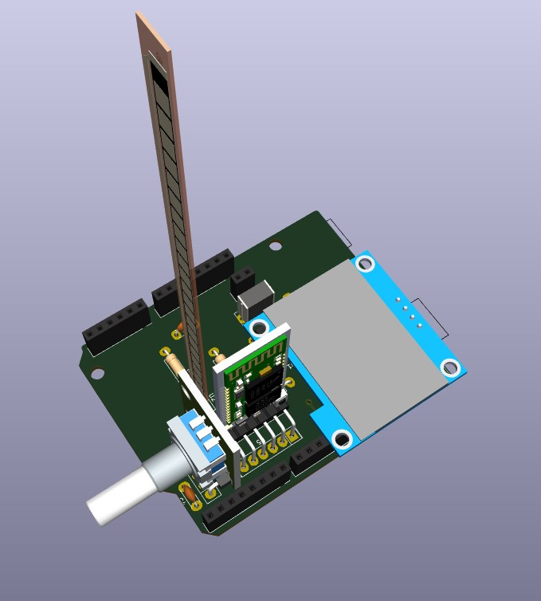
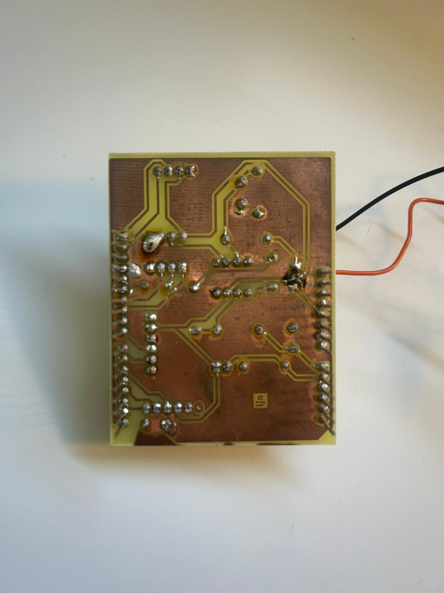
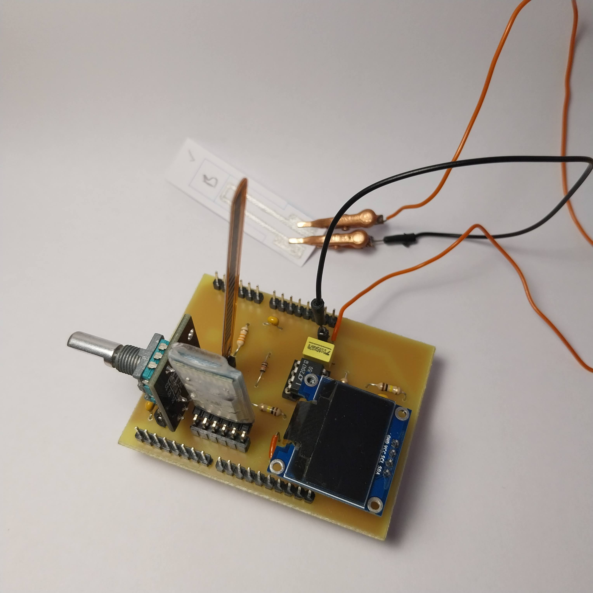
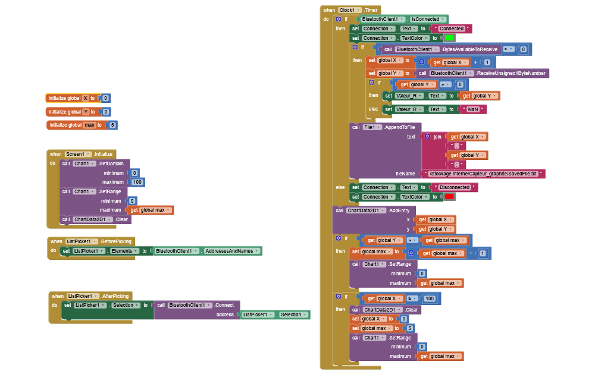
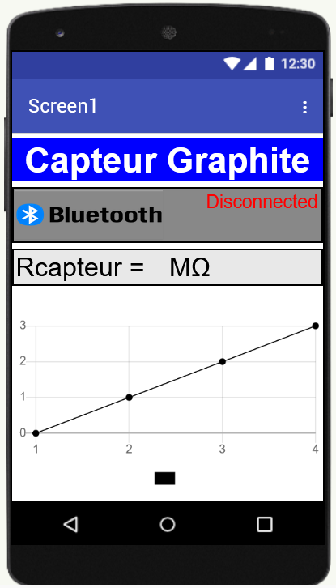
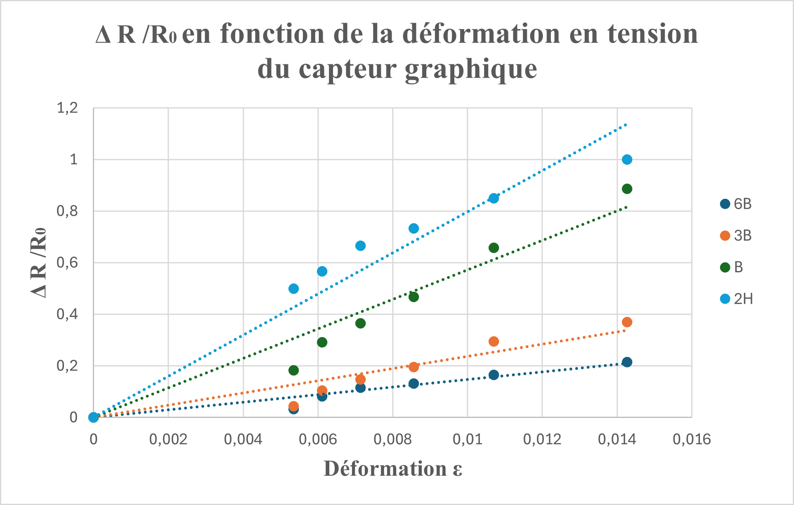

<!DOCTYPE html>
<html lang="fr">
<head>
  <meta charset="UTF-8">
</head>

<body>

# 2024-2025-4GP-JoakimGomes-LucieSvc-Poupouj
## Développement d'un capteur low-tech à base de Graphite : de la conception au test

### Sommaire

<ul>
<li> <a href="#Introduction">Introduction </a></li>
<li> <a href="#Livrables">Livrables </a></li>
<li> <a href="#Matériel à disposition">Matériel à disposition </a></li>
<li> <a href="#Simulation électronique sur LTSpice">Simulation électronique sur LTSpice </a></li>
<li> <a href="#Design du PCB avec KiCad">Design du PCB avec KiCad </a></li>
<li> <a href="#Réalisation du Shield">Réalisation du Shield </a></li>
<li> <a href="#Développement du code Arduino">Développement du code Arduino </a></li>
<li> <a href="#Développement de l'application mobile APK avec MIT App Inventor">Développement de l'application mobile APK avec MIT App Inventor </a></li>
<li> <a href="#Banc de test">Banc de test </a></li>
<li> <a href="#Datasheet">Datasheet </a></li>
<li> <a href="#Conclusion">Conclusion </a></li>
</ul>

<h2 id="Introduction">Introduction</h2>

L'UF "du capteur au banc de test" a pour objectif de concevoir un capteur low-tech et de pouvoir ensuite le tester afin de le comparer avec un capteur commercial. Le capteur est à base de graphite, que l'on retrouve notamment dans nos crayons à papier. Son développement est issu de l'article scientifique <i>"Pencil Drawn Strain Gauges and Chemiresistors on Paper"</i>(Cheng-Wei Lin*, Zhibo Zhao*, Jaemyung Kim & Jiaxing Huang). Concevoir ce capteur est relativement simple : on applique à l'aide d'un crayon, du graphite sur un morceau de papier. Les couches de graphite déposées sur le papier agissent comme un conducteur électrique qui, lorsqu'on déforme le papier, a une conductivité (et donc une résistance) qui varie. Cela s'explique par le fait que  le nombre de chaînes de particules de graphite connectées varie selon le type de déformation. En tension, il y a moins de chaines et ces dernières sont plus courtes. C'est le contraire en compression avec des chaines plus proches, laissant ainsi mieux passer le courant.

 

<i>Figure 1 : Image issue de l'article "Pencil Drawn Strain Gauges and Chemiresistors on Paper" qui explique les déformations des chaines sous compression et tension</i>

<h2 id="Livrables">Livrables</h2>

Les livrables de ce projet sont les suivants:

<ul>
<li>Un schield PCB connecté à une carte Arduino UNO et contenant divers éléments:
<ul>
<li>Notre capteur de contrainte Low-tech</li>
<li>Un capteur de flexion commercial</li>
<li>Un amplificateur dont on pourra modifier le gain grâce à un potentiomètre pour le traitement du signal</li>
<li>Un écran OLED pour afficher les données du capteur</li>
<li>Un module Bluetooth permettant la communication avec un téléphone portable</li>
<li>Un encodeur rotatoire pour naviguer dans le menu de l'écran OLED</li>

</ul>
</li> 
<li>
Le code Arduino qui permet de faire fonctionner tout le système : la communication Bluetooth, la gestion de l'écran OLED avec affichage des données, l'utilisation des deux capteurs de contrainte, la navigation dans le menu de l'écran OLED grâce à l'encodeur rotatoire, la modification du gain grâce au potentiomètre digital.
</li> 
<li>
L'application Android developpée sur MIT App Inventor, permettant de visualiser les données directement sur son téléphone grâce à la communication Bluetooth.
</li> 
<li>
Une datasheet pour le capteur en graphite détaillant ses performances et caractéristiques techniques.
</li> 
</ul>

<h2 id="Matériel à disposition">Matériel à disposition</h2>

Voici la liste du matériel nécessaire pour concevoir le système ci-dessus:

<ul>
<li>Résistances: une résistance de 1kΩ, une résistance de 10kΩ, deux résistances de 100 kΩ, une résistance de 47kΩ pour le Flex sensor commercial et enfin un potentiomètre digital MCP41050</li>
<li>Capacités: trois capacités de 100 nF et une capacité de 1 µF</li>
<li>Un Arduino Uno</li>
<li>Un capteur graphite fait à partir d'un support papier et d'un crayon</li>
<li>Un Flex Sensor commercial</li>
<li>Un encodeur rotatoire ESP32</li>
<li>Un écran OLED 128x64</li>
<li>Un module Bluetooth HC-05</li>
<li>Un amplificateur opérationnel LTC1050</li>
</ul>

<h2 id="Simulation électronique sur LTSpice">Simulation électronique sur LTSpice</h2>

Les valeurs de résistance de notre capteur graphite sont très élevées, de l'odre du MΩ. Afin de pouvoir les mesurer correctement, il est nécessaire d’amplifier le signal avant acquisition. Le courant mesuré après application d'une tension de 5V est donc très faible. Il est donc nécessaire d'amplifier le signal avant son acquisition

Nous avons donc simulé un montage amplificateur transimpédance sur LTspice pour l'optimiser au mieux pour notre capteur : 

<i>Figure 3 : Schéma de notre montage amplificateur sur LTSpice</i>

Ce montage permet d'amplifier le signal du capteur à l'aide de l'amplificateur LTC1050, puis de le filtrer. Ce dernier est divisé en 3 pour limiter le bruit  :

<ul>
<li> R5 et C1 : possède une fréquence de coupure de 16Hz et permet d'atténuer les bruits présents sur le signal d’entrée</li>
<li> R3 et C4 en association avec l’AOP : filtre passe-bas avec une fréquence de coupure de 1,6 Hz, qui permet de filtrer le 50 Hz du réseau électrique</li>
<li> R4 et C2 : possède une fréquence de coupure de 1,6 kHz et permet de filtrer les bruits parasites engendrés par le traitement du signal</li>
</ul>

La tension mesurée, V_ADC, permet ainsi de remonter à la valeur de résistance du graphite mesurée par le capteur, R_capteur , grâce à la formule : 

R_capteur=R1*(1+R3/R_pot)*Vcc/V_ADC-R1-R5

<h2 id="Design du PCB avec KiCad">Design du PCB avec KiCad</h2>

La conception du PCB s'est faite à partir du logiciel KiCad 9.0

Nous avons dans un premier temps reproduit le schéma électrique du système sur l'éditeur de Schématique. Il a fallu créer certains composants et récupérer d'autres dans les librairies de symboles (résistances et capacités notamment). Nous avons associé à chaque composant une empreinte et un modèle 3D. On peut alors effectuer l'ensemble des connexions entre les composants et l'Arduino via l'éditeur de Schématique.

<i>Figure 4 : ensemble du fichier Schématique sous KiCad 9.0</i>

Une fois le schéma électrique terminé, il faut placer les composants sur le PCB grâce à l'éditeur de PCB. L'objectif est de placer les composants judicieusement pour respecter les contraintes imposées, notamment éviter les vias, vérifier que les composants ne se superposent pas physiquement, respecter les dimensions des pistes et l'isolation.

 

<i>Figure 5 : Disposition des composants sur l'éditeur de PCB</i>

 

Et voici la visualisation 3D de notre PCB avec tous les composants (l'amplificateur est sous l'écran OLED).

 
<i>Figure 6 : Visualisation 3D du PCB et composants</i>

<h2 id="Réalisation du Shield">Réalisation du Shield</h2>

Une fois la conception du PCB sur KiCad terminée, nous avons pu passer à la réalisation physique de ce PCB. 
La première étape essentielle a consisté en la vérification du schéma du circuit imprimé (PCB) à l’aide du logiciel KiCad, afin de s’assurer de sa conformité avant toute fabrication. Une fois cette vérification effectuée, le masque de gravure du PCB a été généré à partir du même logiciel.
Ensuite, a fabrication a débuté par l’insolation UV d’une plaque d’époxy recouverte d’une fine couche de cuivre et d’un film photosensible. Cette exposition à la lumière permet de durcir les zones du film correspondant aux futures pistes du circuit. La plaque a ensuite été plongée dans un révélateur, ce qui a permis de dissoudre la résine restée non exposée à la lumière. La gravure des pistes a ensuite été réalisée par immersion de la plaque dans une solution de perchlorure de fer, qui attaque le cuivre non protégé par la résine insolée. Enfin, un nettoyage à l’acétone a permis de retirer les résidus de résine, révélant ainsi les pistes de cuivre définitives du circuit imprimé.
L’ensemble de ces étapes de fabrication a été réalisé par Cathy Crouzet.

Maintenant que toutes ces étapes ont été effectué, nous allons procéder au montage du capteur. Dans un premier temps, nous avons percé tous les trous afin de pouvoir souder tous les supports des composants sur la PCB. Ensuite, nous pouvons donc souder tous les supports des composants sur la PCB (cf Figure 7). Pour finir, il suffit de simplement mettre les composants sur leur support. Notre capteur est enfin prêt à être utilisé ! (cf Figure 8) 

 
<i>Figure  7: Visualisation de la face arrière de la PCB, c'est à dire les soudures.</i>

 
<i>Figure  8: Visualisation de la face avant de la PCB, c'est à dire les composants</i>

<h2 id="Développement du code Arduino">Développement du code Arduino</h2>

Une fois la réalisation physique de notre plaque PCB effectuée, il faut à présent développer le code Arduino. Vous pouvez voir notre code sur le github dans la partie "Code Arduino" : https://github.com/MOSH-Insa-Toulouse/2024-2025-4GP-JoakimGomes-LucieSvc-Poupouj/blob/main/Code_Arduino/Capteur_graphite.ino

<h2 id="Développement de l'application mobile APK avec MIT App Inventor">Développement de l'application mobile APK avec MIT App Inventor</h2>

En même temps que la réalisation du code arduino, nous avons développé une application mobile APK avec MIT App Inventor. Cette application permet d'effectuer les mesures du capteur graphite, notamment obtenir un graphe  de la résistance en fonction de la tension/compression en temps réel. L'application connecte donc via le module bluetooth notre capteur avec un téléphone android.

 
<i>Figure  9: Visualisation du code de l'application</i>

 
<i>Figure  10: Visualisation de l'interface de l'application</i>

<h2 id="Banc de test">Banc de test</h2>

Maintenant que notre plaque PCB est réalisé virtuellement, puis physiquement, et que notre code arduino ainsi que notre application fonctionnent correctement, nous pouvons réaliser le banc de test. L'objectif est de calculer la valeur de la résistance du capteur graphite pour différentes valeurs de déformation. Pour cela nous avons utilisé un support avec des cylindres de rayons différents (1,5 cm, 2 cm, ..., 4cm). 

Notre papier de test ayant une épaisseur e = 0,214mm nous pouvons calculer la déformation engendrée par chacun des rayons de courbure avec la formule : ϵ = e/2r

Nous avons donc effectué des mesures en Tension et en Compression pour des crayons de duretés différentes (2H, B, 3B, 6B) avec une valeur de potentiomètre 1 960 Ω.

En traçant la courbe ΔR/R0 en fonction de la déformation, la théorie nous dit que nous devons avoir une relation linéaire entre les 2. Nous avons donc tracé une droite de régression linéaire passant par 0 pour chacune des courbes et trouvons les résultats suivants :

 
<i>Figure  11: Courbes de ΔR/R0 en fonction de la déformation en Tension</i>

 
<i>Figure  12: Courbes de ΔR/R0 en fonction de la déformation en Compression</i>

Comme prédit par la théorie, nous pourvons observer que en Tension la résistance augmente avec la déformation, alors qu'en Compression elle diminue. De plus, plus le crayon est sec (ex : 2H) plus la pente est élevée. Nous remarquons cependant que pour le crayons 2H semble perdre en précision quand la déformation est élevée (pente de la courbe diminue). Cela peut s'expliquer car il y a très peu de chaines de particules permettant la déformation.

<h2 id="Datasheet">Datasheet</h2>

Le contenu de notre Datasheet se trouve avec le lien suivant : https://github.com/MOSH-Insa-Toulouse/2024-2025-4GP-JoakimGomes-LucieSvc-Poupouj/blob/main/Datasheet_Capteur_Graphite.docx

<h2 id="Conclusion">Conclusion</h2>

Pour conclure, ce projet capteur a été très enrichissant sur plusieurs aspect. Nous avons pu développer de nombreuses compétences, surtout sur un aspect technique. Le plus passionant au sein de ce projet étant la réalisation du projet de A à Z. En effet, nous avons commencé par la théorie, puis la pratique avec la fabrication du capteur, jusqu'au résultat final et une analyse de mesure. C'est donc un projet très complet d'un point de vue pédagogique. 

En ce qui concerne le capteur graphite réalisé, il fonctionne et est utilisable. En revanche, il manque encore grandement de précision. En effet, il n'est pas assez "stable" et "constant" lors de son utilisation. Par exemple, il ne donne pas exactement les mêmes résultats après chaque mesure réalisée de manière identique. Ceci est sûrement dû au manque de matériel de mesure précis. Effectivement, faire les mesure "à la main" n'est pas très bon d'un point de vue rigueur et scientifique. Le capteur manque parfois de graphite ou alors la flexion ou compression n'est pas exactement bien réalisé... De plus on peut voir la limite d'utilisation au crayon HB (cf datasheet), en dessous duquel (donc crayon moins gras), il n'est plus possible d'être mesuré. Il ne peut donc pas être encore industrialisable.

</body>
</html>