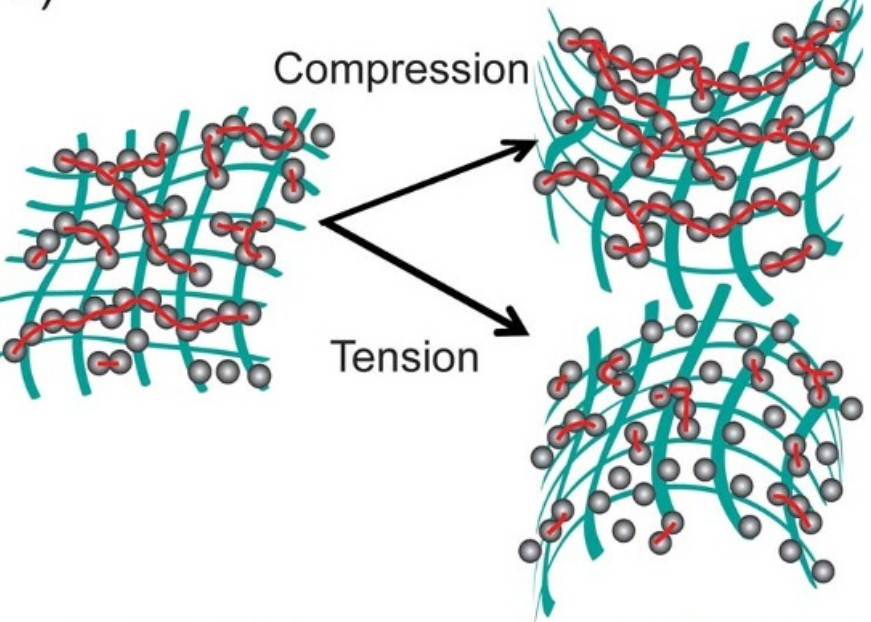
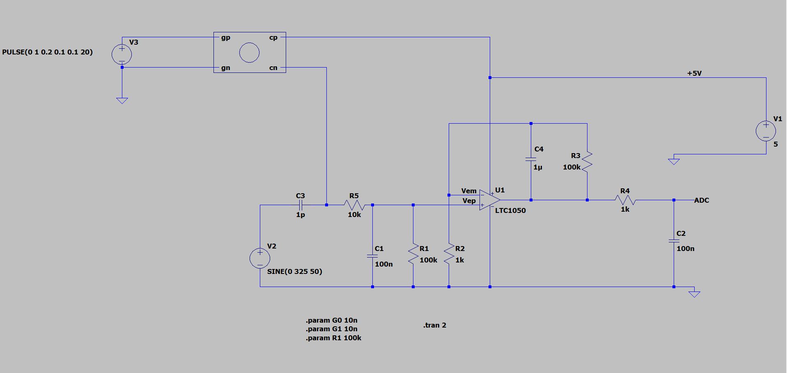
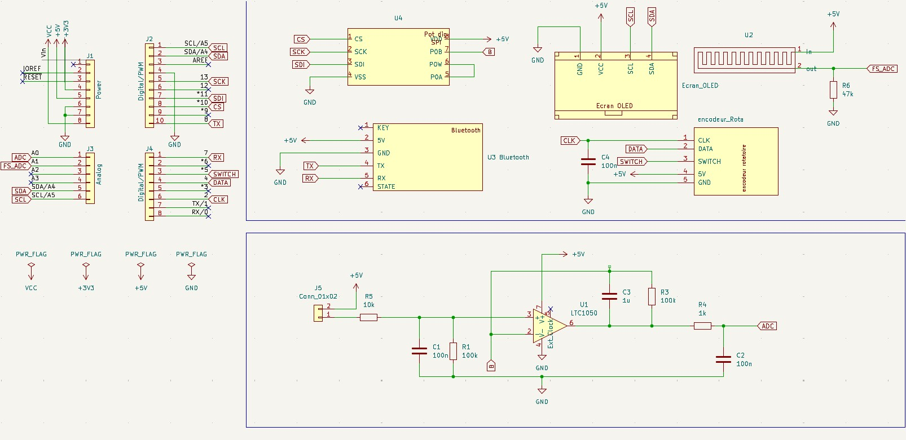
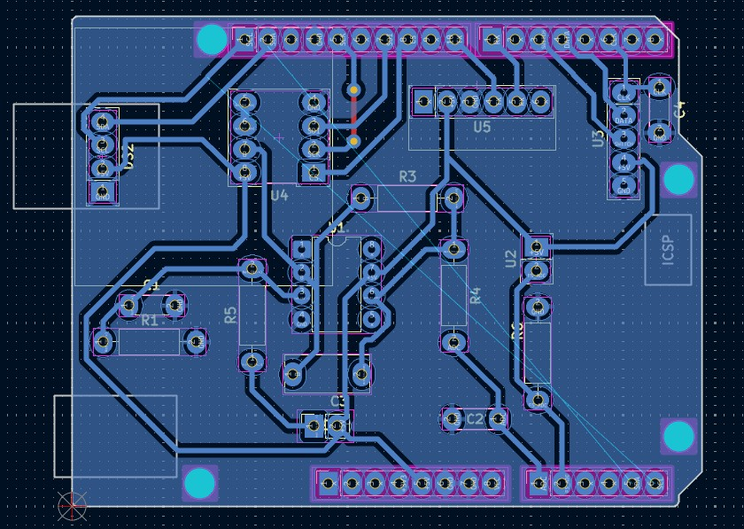

<!DOCTYPE html>
<html lang="fr">
<head>
  <meta charset="UTF-8">
</head>

<body>

# 2024-2025-4GP-JoakimGomes-LucieSvc-Poupouj
## Développement d'un capteur low-tech à base de Graphite : de la conception au test

### Sommaire

<ul>
<li> <a href="#Introduction">Introduction </a></li>
<li> <a href="#Livrables">Livrables </a></li>
<li> <a href="#Matériel à disposition">Matériel à disposition </a></li>
<li> <a href="#Simulation électronique sur LTSpice">Simulation électronique sur LTSpice </a></li>
<li> <a href="#Design du PCB avec KiCad">Design du PCB avec KiCad </a></li>
<li> <a href="#Développement du code Arduino">Développement du code Arduino </a></li>
<li> <a href="#Développement de l'application mobile APK avec MIT App Inventor">Développement de l'application mobile APK avec MIT App Inventor </a></li>
<li> <a href="#Banc de test">Banc de test </a></li>
<li> <a href="#Datasheet">Datasheet </a></li>
<li> <a href="#Conclusion">Conclusion </a></li>
</ul>

<h2 id="Introduction">Introduction</h2>

L'UF "du capteur au banc de test" a pour objectif de concevoir un capteur low-tech et de pouvoir ensuite le tester afin de le comparer avec un capteur commercial. Le capteur est à base de graphite, que l'on retrouve notamment dans nos crayons à papier. Son développement est issu de l'article scientifique <i>"Pencil Drawn Strain Gauges and Chemiresistors on Paper"</i>(Cheng-Wei Lin*, Zhibo Zhao*, Jaemyung Kim & Jiaxing Huang). Concevoir ce capteur est relativement simple : on applique à l'aide d'un crayon, du graphite sur un morceau de papier. Les couches de graphite déposées sur le papier agissent comme un conducteur électrique qui, lorsqu'on déforme le papier, a une conductivité (et donc une résistance) qui varie. Cela s'explique par le fait que  le nombre de chaînes de particules de graphite connectées varie selon le type de déformation. En tension, il y a moins de chaines et ces dernières sont plus courtes. C'est le contraire en compression avec des chaines plus proches, laissant ainsi mieux passer le courant.

<i>Figure 1 : Image issue de l'article "Pencil Drawn Strain Gauges and Chemiresistors on Paper" qui explique les déformations des chaines sous compression et tension</i>

<h2 id="Livrables">Livrables</h2>

Les livrables de ce projet sont les suivants:

<ul>
<li>Un schield PCB connecté à une carte Arduino UNO et contenant divers éléments:
<ul>
<li>Notre capteur de contrainte Low-tech</li>
<li>Un capteur de flexion commercial</li>
<li>Un amplificateur dont on pourra modifier le gain grâce à un potentiomètre pour le traitement du signal</li>
<li>Un écran OLED pour afficher les données du capteur</li>
<li>Un module Bluetooth permettant la communication avec un téléphone portable</li>
<li>Un encodeur rotatoire pour naviguer dans le menu de l'écran OLED</li>

</ul>
</li> 
<li>
Le code Arduino qui permet de faire fonctionner tout le système : la communication Bluetooth, la gestion de l'écran OLED avec affichage des données, l'utilisation des deux capteurs de contrainte, la navigation dans le menu de l'écran OLED grâce à l'encodeur rotatoire, la modification du gain grâce au potentiomètre digital.
</li> 
<li>
L'application Android developpée sur MIT App Inventor, permettant de visualiser les données directement sur son téléphone grâce à la communication Bluetooth.
</li> 
<li>
Une datasheet pour le capteur en graphite détaillant ses performances et caractéristiques techniques.
</li> 
</ul>

<h2 id="Matériel à disposition">Matériel à disposition</h2>

Voici la liste du matériel nécessaire pour concevoir le système ci-dessus:

<ul>
<li>Résistances: une résistance de 1kΩ, une résistance de 10kΩ, deux résistances de 100 kΩ, une résistance de 47kΩ pour le Flex sensor commercial et enfin un potentiomètre digital MCP41050</li>
<li>Capacités: trois capacités de 100 nF et une capacité de 1 µF</li>
<li>Un Arduino Uno</li>
<li>Un capteur graphite fait à partir d'un support papier et d'un crayon</li>
<li>Un Flex Sensor commercial</li>
<li>Un encodeur rotatoire ESP32</li>
<li>Un écran OLED 128x64</li>
<li>Un module Bluetooth HC-05</li>
<li>Un amplificateur opérationnel LTC1050</li>
</ul>

<h2 id="Simulation électronique sur LTSpice">Simulation électronique sur LTSpice</h2>

Les valeurs de résistance de notre capteur graphite sont très élecées, de l'odre du MMΩ. Afin de pouvoir les mesurer correctement, il est nécessaire d’amplifier le signal avant acquisition. Le courant mesuré après application d'une tension de 5V est donc très faible. Il est donc nécessaire d'amplifier le signal avant son acquisition

Nous avons donc similué un montage amplificateur transimpédance sur LTspice pour l'optimiser au mieux pour notre capteur : 

Ce montage permet d'amplifier le signal du capteur à l'aide de l'amplificateur LTC1050, puis de le filtrer. Ce dernier est divisé en 3 pour limiter le bruit  :

<ul>
<li> R5 et C1 : possède une fréquence de coupure de 16Hz et permet d'atténuer les bruits présents sur le signal d’entrée<li>
<li> R3 et C4 en association avec l’AOP : filtre passe-bas avec une fréquence de coupure de 1,6 Hz, qui permet de filtrer le 50 Hz du réseau électrique<li>
<li> R4 et C2 : possède une fréquence de coupure de 1,6 kHz et permet de filtrer les bruits parasites engendrés par le traitement du signal<li>
<ul>

La tension mesurée, V_ADC, permet ainsi de remonter à la valeur de résistance du graphite mesurée par le capteur, R_capteur , grâce à la formule : 

R_capteur=R1*(1+R3/R_pot)*Vcc/V_ADC-R1-R5

<h2 id="Design du PCB avec KiCad">Design du PCB avec KiCad</h2>

La conception du PCB s'est faite à partir du logiciel KiCad 9.0

Nous avons dans un premier temps reproduit le schéma électrique du système sur l'éditeur de Schématique. Il a fallu créer certains composants et récupérer d'autres dans les librairies de symboles (résistances et capacités notamment). Nous avons associé à chaque composant une empreinte et un modèle 3D. On peut alors effectuer l'ensemble des connexions entre les composants et l'Arduino via l'éditeur de Schématique.

<i>Figure 3 : ensemble du fichier Schématique sous KiCad 9.0</i>

Une fois le schéma électrique terminé, il faut placer les composants sur le PCB grâce à l'éditeur de PCB. L'objectif est de placer les composants judicieusement pour respecter les contraintes imposées, notamment éviter les vias, vérifier que les composants ne se superposent pas physiquement, respecter les dimensions des pistes et l'isolation.

<i>Figure 4 : Disposition des composants sur l'éditeur de PCB</i>

<h2 id="Développement du code Arduino">Développement du code Arduino</h2>

Contenu de Développement du code Arduino...

<h2 id="Développement de l'application mobile APK avec MIT App Inventor">Développement de l'application mobile APK avec MIT App Inventor</h2>

Contenu de Développement de l'application mobile APK avec MIT App Inventor...

<h2 id="Banc de test">Banc de test</h2>

Contenu de Banc de test...

<h2 id="Datasheet">Datasheet</h2>

Contenu de Datasheet...

<h2 id="Conclusion">Conclusion</h2>

Contenu de Conclusion...

</body>
</html>